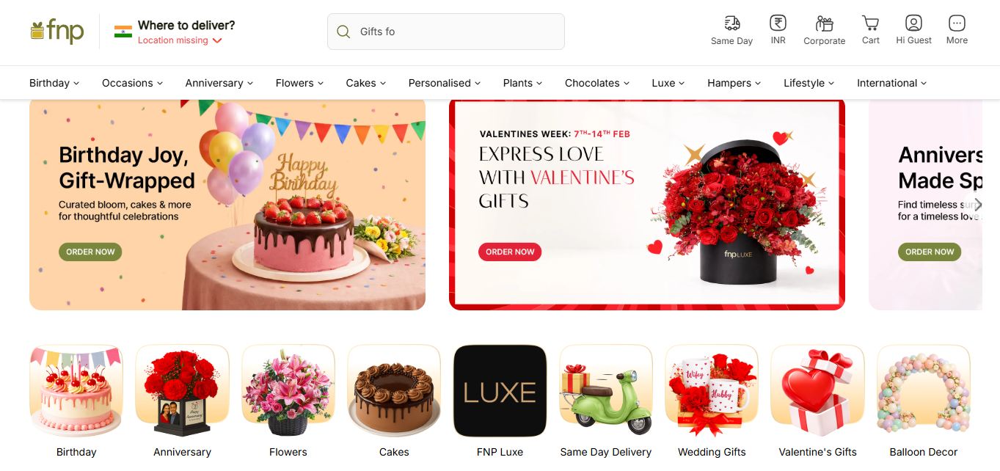
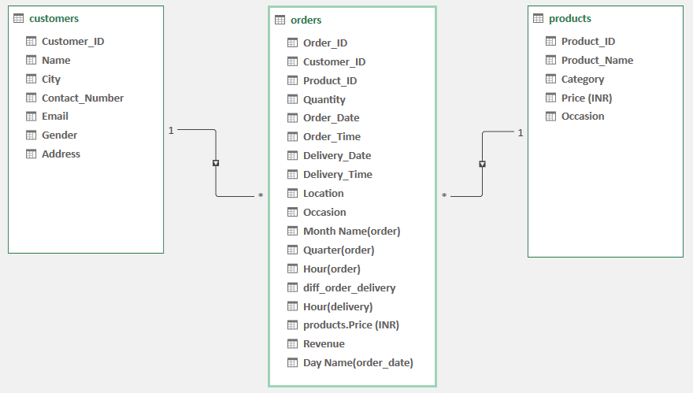
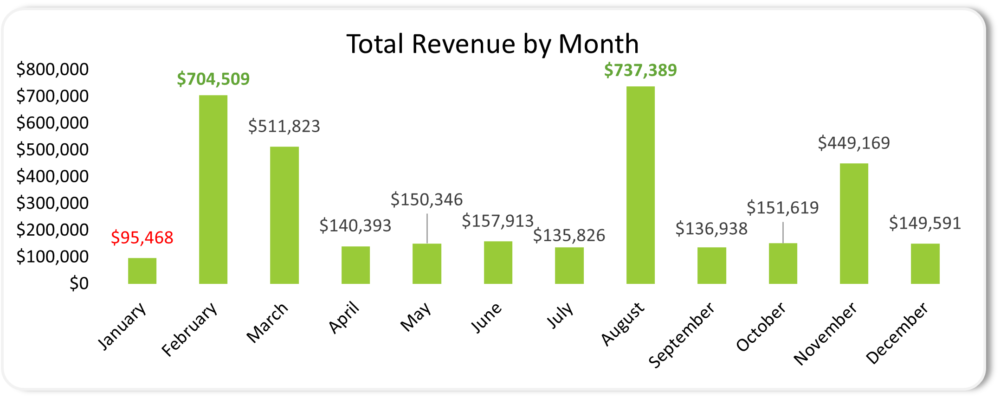
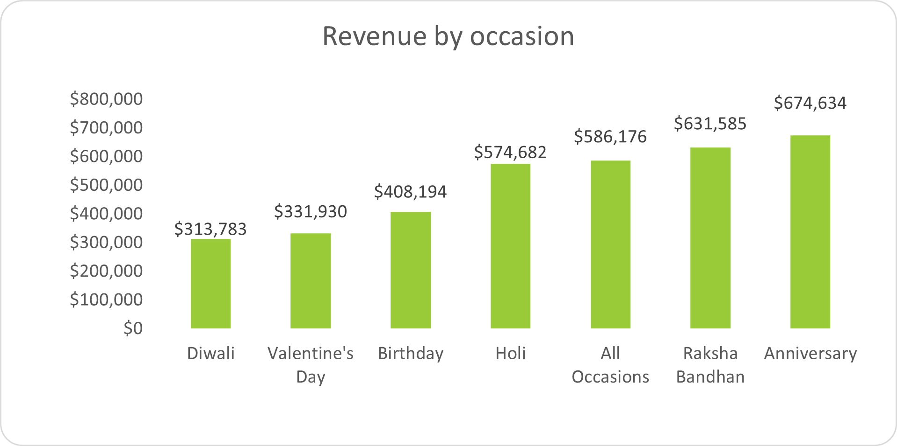
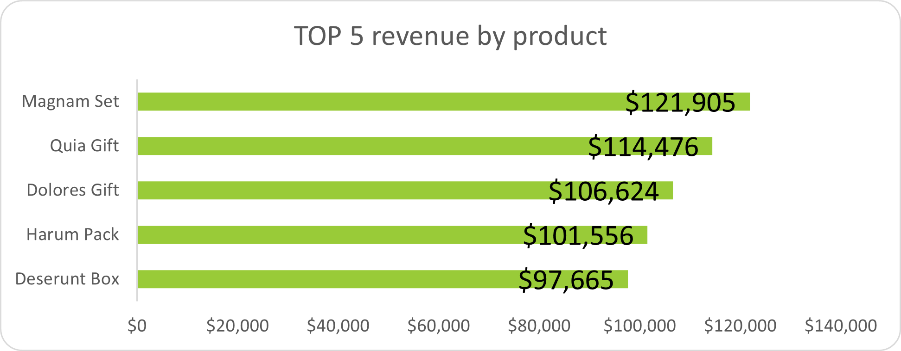
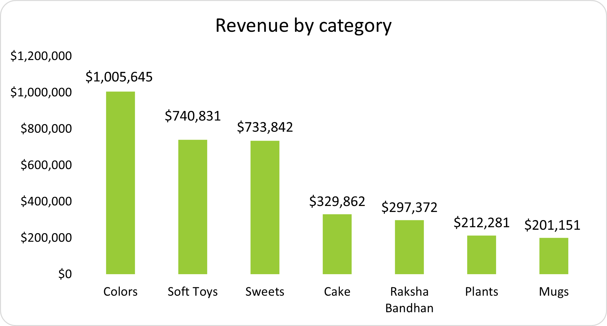
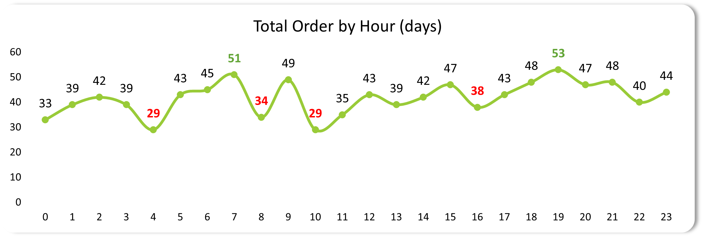
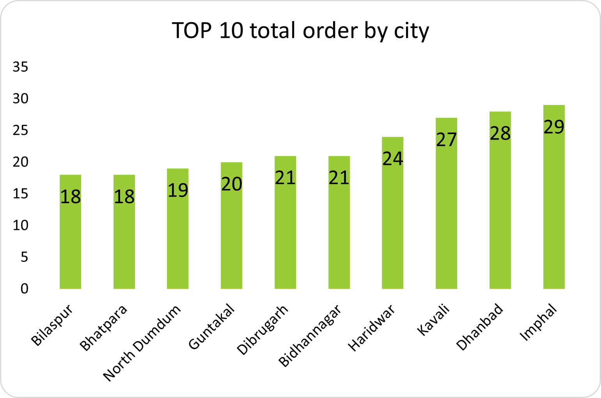

<h1 align='center' style='font-family:cambria'>COMPANY PROFILE</h1>

FNP Corporate started its journey in the year 1994 and today is India’s market leader in the gifting industry. It has grown from a flower shop to a full-running corporate gifting business/ This Company has grown with the spread of modern culture, increasing urbanization and improving standard of living. Ferns N Petals values the sentiments of any organization they have for their human resources. Hence, the organization strives to make gifting and social sentiments culture a big hit in the organized sector.

Ferns N Petals Corporate grants its patrons and followers the very opportunity to buy and send corporate gifts to their acquaintances, by not only providing the former with an assortment of choices but also privileging them with prices that are customer friendly. Hence, whether your search concerns Diwali Gifts for Corporates or promotional products, our online portal harbors them all at your disposal, twenty-four hours a day, seven days a week.

<h2 style='font-family:cambria;text-align:center'>Project Background</h2>
<h3 style='text-align:center;font-family:cambria'>Project ini akan menjadi pemulai dari projek-projeck excel saya lainnya.</h3>

Fern and Petals has sales records full month in 2023 for various special gifts for special occasions or religious events in India, such as Diwali, Raksha Bandhan, Holi, Valentine's Day, birthdays, and anniversaries. It is interesting to analyze their product sales activities. Before addressing the questions that arise from this data, we will look at the categories and groups in the data table itself.

### Dataset Breakdown

This dataset consists of three actual tables, the first of which is the fact table (in star schema form), namely the orders table, followed by the customers table and the products table.

1. Orders Table: Contains customer order activities for purchasing products, including the date of the order and when the product was shipped, as well as the occasion category that was the reason for ordering the item for delivery.
2. Customers Table:
   - Customer_ID: Unique customer ID.
   - Name: Customer name.
   - City: Geographical location.
   - Gender: Gender (Male/Female).
   - Email & Contact_Number: Contact information.
   - Address: Location/address details.
3. Products Table: Contains various products based on their respective categories and according to occasion needs.

<h1 align=‘center’ style=‘font-family:cambria’>Data modeling using Power Pivot to determine relationships between tables</h1>

After extracting and transforming the data, it is then loaded into the Power Query Editor for simple cleaning and validation to ensure consistency for analysis. After this process, the data cannot be used until we model it and connect each table ID to the fact table, which is the main table relation. 

### The following are the results of data modeling using Power Pivot Excel.

### Key Performance Indicator

Before jumping into the questions that can be generated from this dataset, we will first look at the KPIs generated, as follows:

1. Total Orders : **1000 Orders**
2. Total Revenue : **3.5M**
3. Avg D/W Order : **5/6 orders per day of week**
4. Average Customer Spending: **$3,521**

### Jump to the Question

Since we will be conducting a sales analysis, we will certainly look at the monthly revenue generated, monthly growth or decline, purchase behavior, purchase patterns, and the most profitable occasions. The above statement raises the following questions:

## "How does monthly revenue performance (growth or decline) relate to customer purchase behavior, purchasing patterns, and the most profitable occasions?"

<h2 style='font-family:cambria;text-align:center;'>Executive Summary</h2>

---

#### Key Findings :

1. Revenue Growth and Peak Performance
   - From the revenue shown, revenue always grew in the second month of each quarter. In Q1 (January-March), revenue grew in the second month, February, from $95,468 in January, with 638% growth in February to a peak of around $704,509, then slowly declined in the third month until it plummeted at the beginning of the month in the second quarter.
   - Revenue also grew significantly in the third quarter (July-September), with peak performance in August ($737,389), representing a 443% growth from the previous month.
   - In Q4, FNP revenue grew again in the second month of Q4 (November) to a peak of $449,169, a growth of 196% from the beginning of the month in the fourth quarter.
2. Declining Trend and the Worst Performance in the Second Quarter (Q2)
   - FNP's revenue always dropped at the beginning of the month or at the end of the month in that quarter.
   - This can be seen in Q2 in April, when revenue growth peaked in the second month of the second quarter and fell by around -27% in the third month of Q1. The first month of Q2 actually showed poor revenue performance, dropping again by -73% and continuing to fall consistently until the beginning of the third month of the quarter.
3. Monthly (quarterly) Insight and seasonal sales trend
   - Every month that marks revenue growth at FnP is always identical and related to occasions that occur in that month, such as in February (Q1), August (Q3), and towards the end of the year in November (Q4).
   - FnP's sales and revenue in 2023 are highly dependent on seasonal sales trends, where several occasions occur in those months.
4. Key Takeaways and recommendations
   - Launch targeted promotions or loyalty campaigns in Q2 (April-June) to counter -73% drops—e.g., bundle deals or email retargeting for past buyers.
   - Develop year-round products/services (e.g., subscription gifting or corporate bundles) to reduce 80%+ reliance on Feb/Aug/Nov peaks.
   - Track weekly revenue at month-starts; if down >20% from prior month-end, trigger flash sales to stem declines.

---

<h2 style='font-family:cambria;text-align:center'>Breakdown some Revenue and order Pattern</h2>
<h2 style='font-family:cambria;text-align:center'>Revenue Pattern</h2>

---

#### Key Findings (what realy drives revenue by type of occasions)

FnP revenue is primarily driven by high-emotional, relationship-based occasions, with Anniversary as the single largest contributor.

1. What the data shows (Facts)
   - Anniversary is the top revenue driver (~$675K), followed by
   - Raksha Bandhan (~$632K) and All Occasions (~$586K).
2. These top 3 occasions contribute the majority of total revenue.
   - Seasonal occasions (Valentine’s Day, Diwali, Birthday, Holi) generate lower revenue per occasion despite high celebration frequency.
3. So what (Insights)
   - Customers spend more per transaction on personal & emotional occasions.
   - Revenue growth is concentrated, not evenly distributed across occasions.
   - Seasonal occasions suffer from high competition and product substitution.
4. Now what (Implications / Actions)
   - Prioritize investment (marketing, personalization, premium bundles) on:
     - Anniversary, Raksha Bandhan
     - Position “All Occasions” as a revenue stabilizer across the year.
   - Redesign seasonal strategies:
     - Stronger differentiation
     - Value bundles instead of discounts
5. Key Takeaway and recommendations
   - Focusing on the top emotional occasions will deliver disproportionate revenue impact compared to optimizing all occasions equally.

---

---

#### Key Findings (what realy drives revenue by product)

Revenue FnP primarly driven by Set, Gift, Pack And Box, dengan Magnam set to be single largest contributor.

1. What the data shows (The fact)
   - Magnam set are the top revenue by produk driver with ($121,905) followed by,
   - Quia Gift and Dolorest Gift in between $106,624 and $114,476.
   - Revenue difference between Top 5 products is relatively narrow, indicating multiple strong performers rather than one extreme outlier.
2. This top 5 produck contribute the majority of total revenue
   - Deserunt box generate lower revenue by product despite low buying frequency.
   - Revenue is concentrated in a small number of hero products, rather than evenly spread across the catalog.
3. So What (Insight)
   - Customers spend more per transaction on Set and gift than a pack or box.
   - Revenue growth is concentrated, not evenly distributed across product
4. Now What (Implications / Actions)
   - Double down on hero products:
     - Expand Magnum Set variants (price tiers, personalization).
     - Use Sets & Gifts as anchors:
   - Cross-sell Packs and Boxes as add-ons, not standalone.
     - Reposition lower performers:
     - Improve packaging, naming, or bundle them into premium Sets.
5. Key Takeaway and Recommendations
   - A small number of curated Set & Gift products drive disproportionate revenue impact—scaling these will outperform broad catalog optimization.

---

---

#### Key Findings (What realy drives revenue by Category)

FnP revenue generaly driver by color,Soft toys and sweets, with Colors set to be the single largest contributor.

1. What the data shows (The Fact)
   - Colors is the top revenue category generating $1,005,645, significantly ahead of other categories.
   - Soft Toys ($740,831) and Sweets ($733,842) form the second tier of high-performing categories.
   - The remaining categories—Cake, Raksha Bandhan, Plants, and Mugs—each generate below $330K in revenue.
   - Revenue distribution shows clear tiering, rather than an even spread across categories.
2. This 7 category contribute a majority of total revenue
   - There are four categories that generate lower revenue than the top three, indicating low interest and purchasing activity in these four categories.
   - Revenue is concentrated in only three segments of the category, and revenue distribution is inconsistent for the remaining four categories.
3. So what (insight)
   - Customers only spend more than their revenue on the colors, soft toys, and sweets categories than on cakes and mugs.
   - Colors as the dominant category may be linked to festival-driven demand (e.g., Diwali), where decorative and visual products are core to the celebration.
   - Lower-performing categories are not weak products, but likely play a supporting role in bundle or cross-sell strategies.
   - Customers demonstrate a higher willingness to spend on visually attractive and gift-centric categories compared to functional or add-on items.
4. Now what (implication and recommendation)
   - Prioritize inventory, promotion, and assortment expansion for:
     - Colors
     - Soft Toys
     - Sweets
   - Leverage secondary categories as:
     - Bundle add-ons
     - Cross-sell complements to high-performing categories
     - Align category strategy with occasion strategy (e.g., Colors × Diwali, Sweets × Anniversary).
5. Key Takeaway
   - A small set of gift-centric categories drives most of FnP’s revenue—scaling these will deliver higher impact than evenly optimizing all categories.

---

<h2 style='font-family:cambria;text-align:center'>Order Pattern</h2>

---

#### Key Findings (What hour has have a much order by hour)

Customer orders peak during early morning and early evening hours, indicating strong time-based purchasing behavior.

1. What the data shows (Facts)
   - Order volume peaks at 07:00 (51 orders) and have a highest point on order at early evening 19:00 with 53 orders.
   - Secondary high-order periods occur round 09:00-15:00 and 18:00-21:00 within 45 to 48 orders.
   - Lowest order activity appears at 04:00 and 10:00 around 29 orders
2. So What (Insight)
   - A small number of peak hours (morning & evening) generate a disproportionate share of daily orders.
   - Customer purchasing behavior aligns with **pre-work(start-of-day gifting needs)** and **Post works(evening leisure ordering)**.
3. Now What (Implications / Actions)
   - Ensure inventory, delivery capacity and customer support are strongest at 07:00 and 19:00.
   - Schedule push notifications & promors 30-60 minutes before peak hours.
   - Optimize staffing during low-activity hours.
4. Key takeaway
   - Order demands is time-concentrated and optimizing operations around morning and evening peaks will deliver the highest impact.

---

---

#### Key findings (What patterns about total order by city)

There's a clear performance gap between the top and bottom performers. The highest performing city (imphal with 29 orders) has about 61% more orders than the lowest performers (bilaspur and bhatpara, each with 18 orders).

- **Order patterns**
  - The cities form distinct tiers: a bottom pattern(18-21 orders), a middle performer (Haridawar at 24), and a top pattern (27-29 orders).
  - The progression isn't linear - there's a noticeable jump from bidhannagar (21) to haridwar (24) and another from haridwar (24) to kavali (27).
- **Performer and considerations**
  - The top three cities (imphal, dhanbad and kavali) are very close in performance (27-29 orders), suggesting similar market conditions or customers engagement levels.
  - These cities represent diverse regions across india, which could indicate either broad market penetration or specific regional demand patterns worth investigating further.
- **Implications**
  - The relatively narrow range (18-29 orders) across the top 10 cities suggests fairly distributed demand rather than concentration in a few dominant markets.
  - The cities at 18-21 orders might benefit from targeted initiatives to reach the performance levels of the top tiers.

---

### 🚀 Final Business Strategy Recommendations

1. **Flatten the "Revenue Rollercoaster"**
   - The Gap: Your revenue is 80% dependent on three peaks (Feb, Aug, Nov), with a massive -73% drop in Q2.
   - The Action: Launch a "Corporate Subscription Model" or a "Year-Round Loyalty Program" specifically targeting Q2 (April-June) to stabilize cash flow during non-festival months.
2. **Double Down on "Hero" Categories**
   - The Gap: Colors, Soft Toys, and Sweets generate the lion's share of revenue, while Mugs and Plants underperform.
   - The Action: Expand the inventory and variety of the Magnum Set (your top product). Use lower-performing categories (Mugs/Plants) exclusively as "Add-ons" at checkout rather than standalone marketing focuses.
3. **Maximize High-Emotion Occasions**
   - The Gap: Anniversaries and Raksha Bandhan are your biggest money-makers, outperforming generic "Seasonal" holidays.
   - The Action: Shift marketing budget away from high-competition holidays (like Valentine’s) and into personalized Anniversary reminders and premium Raksha Bandhan bundles.
4. **Optimize Operational "Golden Hours"**
   - The Gap: Orders peak sharply at 07:00 and 19:00.
   - The Action: Schedule your flash sales and app push notifications for 06:30 and 18:30 to hit customers right as they begin their peak buying window. Ensure customer support staffing is doubled during these specific windows.
5. **Scale Top-Performing City Hubs**
   - The Gap: Cities like Imphal, Dhanbad, and Kavali are leading in order volume.
   - The Action: Increase local logistics capacity in these top-tier cities to offer "Same Day Delivery," which can further increase order frequency from 29 orders per month to higher benchmarks.

---

| Tool               | Purpose in This Project |
| ------------------ | ----------------------- |
| Power Query Editor | Data cleaning & ETL     |
| Power Pivot        | Data modeling           |
| Pivot Tables       | Data summarization      |

---

Made by Flowlesnes 💥 <u>Faraj Hafidh</u>
